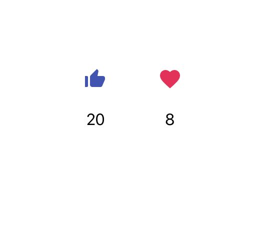

## Like and Love Buttons

This is a simple front-end app that demos a like button and a love button. Below each button, the click count on each button is displayed. As a user, you can click on a button and watch its count increase each time.

## How to Run the App
1. Fork and clone this repo
2. npm install
3. npm start
4. Open http://localhost:3000/ to view in the browser and demo the button functionality

## Technologies Used
- Javascript
- React
- Material UI
- CSS

Each button and its counter functionality were built in an individual React component that is modular and easy to re-use. Material UI icons were used for the buttons.

This project was bootstrapped with [Create React App](https://github.com/facebook/create-react-app).
